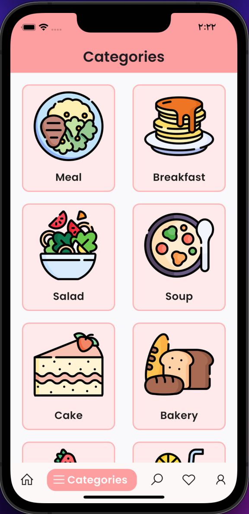

# My Recipes – Mobile Recipe App (Flutter & Firebase)

##  Description
A complete recipe application for both Android and **iOS** platforms, allowing users to save, search, and manage their recipes easily with an intuitive UI and real-time data synchronization via Firebase.

---

##  App Screenshots
### Home Screen

### Add Recipe Screen

### Categories Screen

### Favorites Screen

➡️ See all screenshots in the [screenshots folder](screenshots/)

---

## Features & Achievements
- **Cross-platform development:** Built with Flutter using a single codebase to deliver a native experience on both Android and iOS, with UI optimizations for each platform.
- **Backend integration:** Integrated Firebase Authentication for login, Firestore as the main database for storing recipes and favorites, and Firebase Storage for image hosting.
- **Clean architecture:** Organized code into layers (controllers, core, utilities, widgets) and built reusable components for better maintainability.
- **Testing & deployment:** Added unit tests to ensure the reliability of core features and automated builds for both Android and iOS.

---

## Tech Stack
- Flutter
- Dart
- Firebase (Authentication, Cloud Firestore, Storage)

---

## License
This project is licensed under the **MIT License (Non-Commercial)** – see the [LICENSE](LICENSE) file for details.
